[English](./README.md) | **中文**

# OpenClaw 微信客服插件

[](https://www.npmjs.com/package/@pawastation/wechat-kf)
[](LICENSE)
[](https://openclaw.dev)

让微信用户通过**微信客服**与你的 OpenClaw AI Agent 对话。

---

## 功能介绍

### 可接收的消息类型

| 消息类型   | 说明                                                 |
| ---------- | ---------------------------------------------------- |
| 文本       | 普通文字，含菜单回调                                 |
| 图片       | 图片附件                                             |
| 语音       | AMR 格式语音                                         |
| 视频       | 视频附件                                             |
| 文件       | 各类文件附件                                         |
| 链接       | 分享的链接卡片                                       |
| 小程序     | 小程序消息卡片                                       |
| 位置       | 地理位置（含坐标）                                   |
| 合并转发   | 多条消息合并转发，支持提取链接/位置/小程序/视频号详情，下载图片/语音/视频/文件 |
| 视频号商品 | 视频号商品卡片                                       |
| 视频号订单 | 视频号订单消息                                       |
| 视频号消息 | 视频号动态、直播或名片，仅返回部分字段（昵称、标题） |
| 用户笔记   | 仅识别类型，API 不支持读取内容                       |

### 可发送的消息类型

| 消息类型   | 说明             |
| ---------- | ---------------- |
| 文本       | 普通文字         |
| 图片       | 图片附件         |
| 语音       | AMR 语音         |
| 视频       | 视频附件         |
| 文件       | 各类文件         |
| 链接卡片   | 带封面图的富链接 |
| 小程序卡片 | 小程序跳转卡片   |
| 菜单       | 快捷回复菜单按钮 |
| 名片       | 企业员工名片     |
| 位置       | 地理位置         |
| 获客链接   | 企业获客链接卡片 |

### 微信特色功能

- **Markdown 样式**：Agent 回复中的粗体、列表、标题等 Markdown 格式，自动转换为微信可显示的 Unicode 样式（粗体用 𝗯𝗼𝗹𝗱 字体，列表用符号等）：

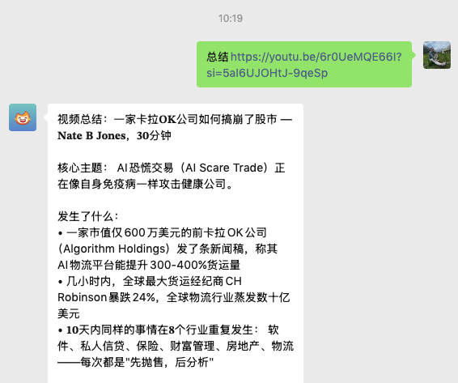

- **消息防抖合并**（`debounceMs`）：用户连续快速发出多条消息时，插件会等待设定的时间窗口内无新消息后，再将所有消息合并一次性发给 Agent，避免 Agent 对同一用户意图重复响应。

---

## 为什么选微信客服 API？

相比其他接入微信的方式，微信客服（WeChat KF API）有几个明显优势：

1. **不需要关注公众号** — 用户可以直接点链接发起对话，无需先关注任何账号（后续也可在客服消息中找回历史对话）
2. **可以发起主动消息** — 在 48 小时会话窗口内，你可以主动给用户发消息（最多五次，但用户恢复后即重置）
3. **支持多种消息类型** — 文本、图片、语音、视频、文件、链接卡片、小程序卡片、菜单等
4. **接入简单** — 不需要认证域名，不需要 IP 白名单，用普通 Tunnel 公网地址就能跑
5. **个人就能注册** — 不需要企业资质，用企业微信 App 就能注册一个"企业"并创建客服账号
6. **免费** — 微信客服 API 本身免费，无需公众号认证或服务号

---

## 前提条件

1. **企业微信账号** — 用企业微信 App 注册即可（个人就能注册，不需要真实企业）
2. **已安装并运行 OpenClaw** — 参考 [OpenClaw 文档](https://docs.openclaw.ai/)

---

## 快速开始

### 第 1 步：安装插件

```bash
# 首次安装
openclaw plugins install @pawastation/wechat-kf

# 升级
openclaw plugins update @pawastation/wechat-kf
```

### 第 2 步：安装 Tunnel（cloudflared）

微信客服需要一个公网可访问的回调地址。推荐使用 Cloudflare Tunnel：

```bash
# macOS
brew install cloudflare/cloudflare/cloudflared

# 启动 tunnel（把 7860 换成你的 OpenClaw Gateway 端口）
cloudflared tunnel --url http://localhost:7860
```

启动后会显示一个 `https://xxxx.trycloudflare.com` 地址，记下来后面要用。

> 也可以使用 Tailscale Funnel、ngrok 等服务来生成公网地址。

### 第 3 步：注册企业微信

如果你还没有企业微信账号：

1. 下载**企业微信** App
2. 菜单点击 → 创建/加入企业
3. 选择**其他**（按实际情况填写表单提交）

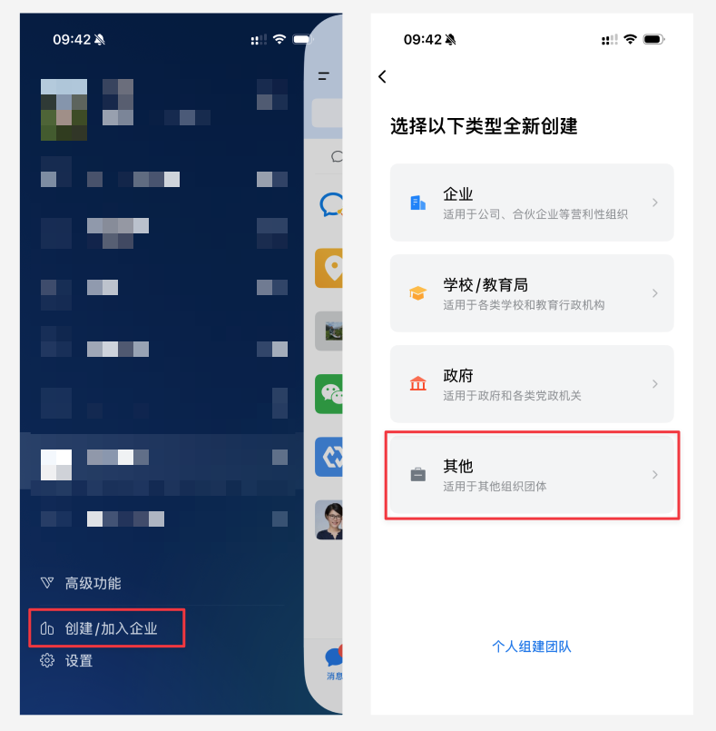

### 第 4 步：创建客服账号

1. 打开[微信客服管理后台](https://kf.weixin.qq.com/)（用企业微信 App 扫码登录）
2. 创建一个客服账号（设置名称和头像）


同时在这里复制**企业 ID**（Corp ID）备用：

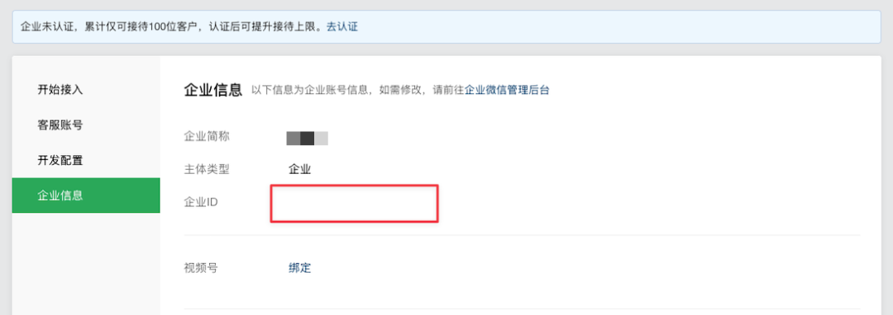

### 第 5 步：在微信客服后台配置回调

1. 打开[微信客服管理后台](https://kf.weixin.qq.com/) → **开发配置** → **开始使用**
2. 填入回调地址（你的 Tunnel 地址 + `/wechat-kf`，例如 `https://xxxx.trycloudflare.com/wechat-kf`）
3. 点击**「随机获取」**生成 Token 和 EncodingAESKey

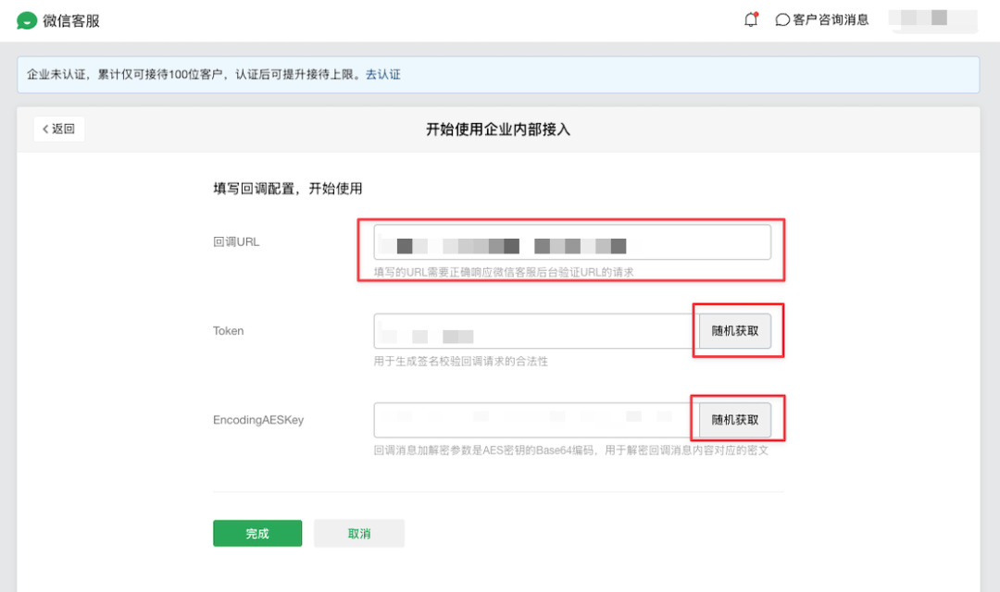

**先复制好 Token 和 EncodingAESKey，暂时不要点「保存」** — 下一步先把这两个值填入 OpenClaw，再回来保存验证。

### 第 6 步：配置 OpenClaw 后台

进入 OpenClaw 后台，添加微信客服渠道配置。`appSecret` 先随便填一个占位值（第 8 步替换），把上一步生成的 Token 和 EncodingAESKey 填入对应字段，**保存配置**：

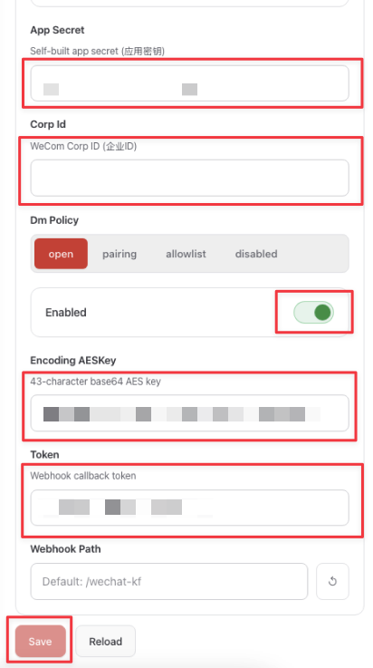

OpenClaw 配置示例：

```yaml
channels:
  wechat-kf:
    enabled: true
    corpId: "wwXXXXXXXXXXXXXXXX" # 第 4 步复制的企业 ID
    appSecret: "placeholder" # 先填占位，第 8 步替换
    token: "从第 5 步复制"
    encodingAESKey: "从第 5 步复制"
```

保存后 OpenClaw 会立即开始监听回调地址，下一步微信的验证请求才能通过。

### 第 7 步：回到微信客服后台完成验证，获取 Secret

回到[微信客服管理后台](https://kf.weixin.qq.com/)的开发配置页面，点击**「保存」** — 微信会立即向你的回调地址发一个验证请求，OpenClaw 自动回应，验证通过后配置生效。

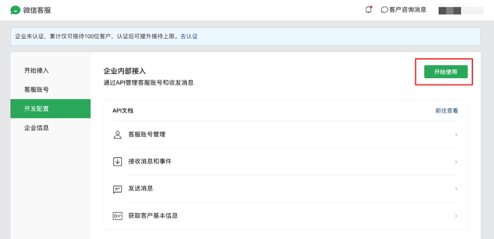

验证通过后，在同一页面复制 **App Secret**：

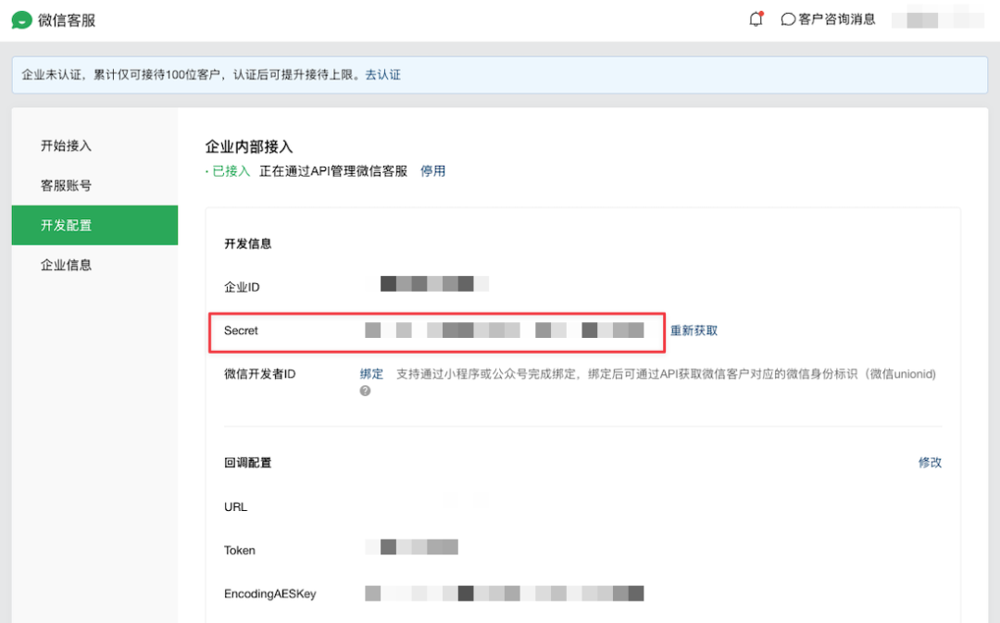

### 第 8 步：更新 Secret

把第 6 步填的占位 Secret 替换为刚复制的实际值，保存配置：

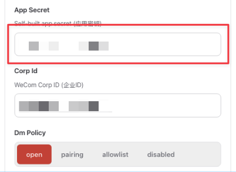

### 第 9 步：开始聊天

在微信客服后台找到你的客服账号，复制**客服链接**分享给用户（或者自己先测试）：

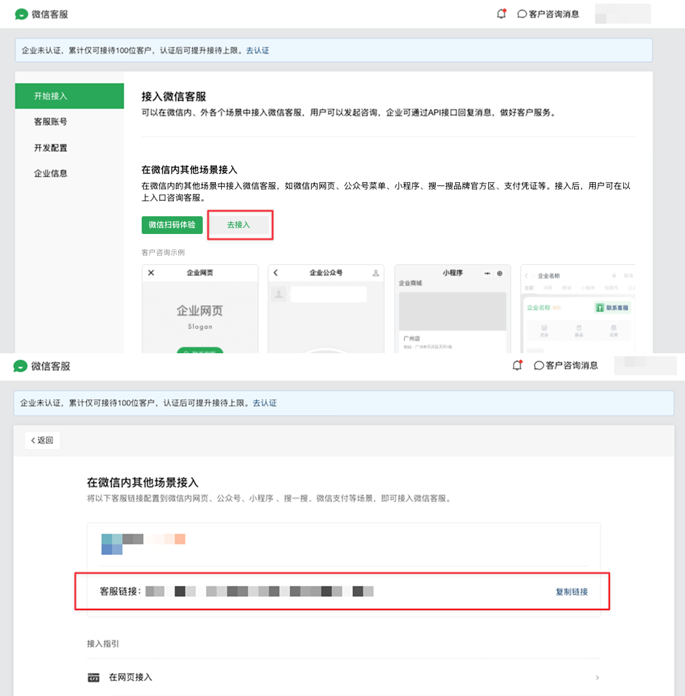

用微信扫码或点开链接，就能和你的 AI Agent 对话了。

### 第 10 步：安全设置（推荐）

默认情况下，任何拿到客服链接的人都可以发消息。如果你想限制访问，可以开启 `pairing`（配对）模式：

在 OpenClaw 后台把 `dmPolicy` 改为 `pairing`：

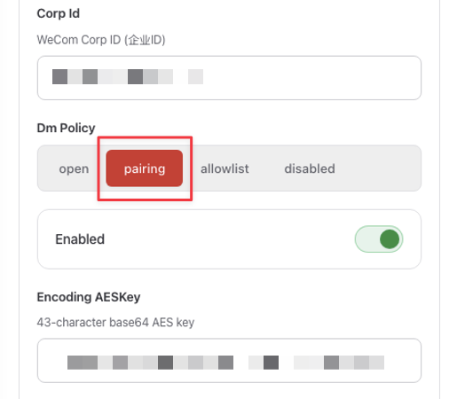

开启后，新用户第一次发消息会收到配对码：

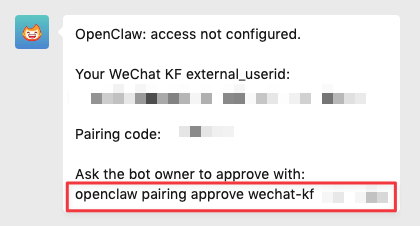

在 openclaw 所在电脑上运行以下命令批准：

```bash
openclaw pairing approve wechat-kf <配对码>
```

---

## 配置参考

| 字段             | 类型     | 必填   | 默认值       | 说明                                                                                                           |
| ---------------- | -------- | ------ | ------------ | -------------------------------------------------------------------------------------------------------------- |
| `enabled`        | boolean  | 否     | `false`      | 是否启用该渠道                                                                                                 |
| `corpId`         | string   | **是** | —            | 企业 ID                                                                                                        |
| `appSecret`      | string   | **是** | —            | 微信客服 Secret（从微信客服后台「开发配置」获取）                                                              |
| `token`          | string   | **是** | —            | Webhook 回调 Token                                                                                             |
| `encodingAESKey` | string   | **是** | —            | 43 位 AES 加密密钥                                                                                             |
| `webhookPath`    | string   | 否     | `/wechat-kf` | Webhook 回调 URL 路径                                                                                          |
| `dmPolicy`       | string   | 否     | `"open"`     | `open`（开放）/ `allowlist`（白名单）/ `pairing`（配对）/ `disabled`（禁用）                                   |
| `allowFrom`      | string[] | 否     | `[]`         | 允许的 external_userid 列表（dmPolicy 为 `allowlist` 时使用）                                                  |
| `debounceMs`     | number   | 否     | `2000`       | 消息防抖窗口（毫秒，0–10000）：等待窗口内无新消息后再发给 Agent，适合用户分多条消息输入的场景；设为 `0` 可禁用 |

---

## 有什么限制？

- **任何人都能发消息** — 拿到客服链接的人都能发消息，这是微信平台层面的设计，无法阻止。可以用 `dmPolicy: "pairing"` 或 `"allowlist"` 让 Agent 只回复指定用户。
- **48 小时回复窗口** — 用户最后一条消息后 48 小时内才能回复。超时后需要用户再发一条消息才能继续。
- **5 条消息限制** — 在用户发下一条消息前，最多只能发 5 条回复。
- **语音格式** — 入站语音为 AMR 格式，是否能转录取决于你的 Agent 配置。
- **Tunnel 地址会变** — 使用 cloudflared 免费隧道时，每次重启地址会变。固定地址可以购买域名并解析到服务器，或使用付费 Tunnel（如 Cloudflare Zero Trust）、有静态 IP 的服务器。

---

## 开发者文档

架构设计、模块说明、开发命令和贡献流程，请参阅 [CONTRIBUTING.md](./CONTRIBUTING.md)。

---

## 许可证

MIT
